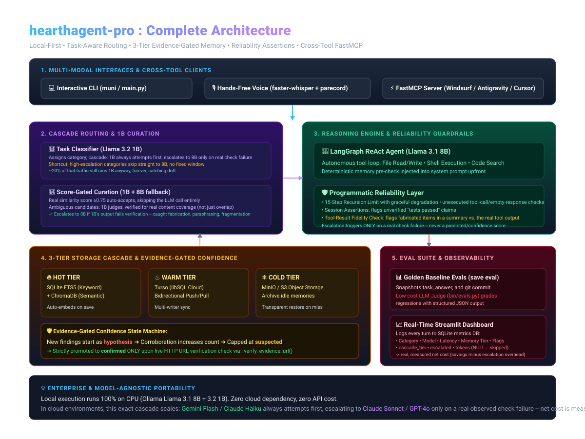

# hearthagent-pro

A production-grade, local-first AI coding agent with automatic task-aware model routing, a 3-tier memory cascade (hot/warm/cold), evidence-gated confidence scoring, deterministic reliability assertions, local voice input, and cross-tool MCP memory sharing.

Runs 100% locally on consumer hardware via Ollama (CPU-only, no mandatory cloud dependencies, no per-token billing).

---



---

## Architecture & Key Features

### 1. Task-Aware Model Routing & Curation
* **Task Classifier:** Uses a lightweight, fast model (`llama3.2:1b`) to classify intent (`investigate`, `implement`, `unit_tests`, `general`, `extract`) and route tasks.
* **Reasoning & Coding:** Heavy reasoning, complex coding, and tool execution run on `llama3.1:8b`.
* **Candidate Memory Curation:** Retrieved memory candidates are pre-filtered by `llama3.2:1b` for actual task relevance before injection into the main prompt—preventing context pollution and false-positive faithfulness flags.

### 2. Multi-Tier Memory System (Hot / Warm / Cold)
* **Hot Tier:** Local SQLite FTS5 (keyword search) + ChromaDB (semantic vector search via `all-MiniLM-L6-v2` embeddings). New memories auto-embed immediately on save.
* **Warm Tier:** Turso (libSQL) with bidirectional push/pull sync for multi-writer collaboration.
* **Cold Tier:** MinIO (S3-compatible object storage) for archiving idle memories and transparent retrieval on search misses.
* **Evidence-Gated Confidence Lifecycle:** New memories start at `hypothesis`. Corroboration increases confidence, but upgrading to `confirmed` strictly requires an automated HTTP check against a verified evidence URL (otherwise capped at `suspected`).

### 3. Production Reliability Layer
* **Graph Recursion Guard:** Caps agent loops at 15 internal steps with graceful fallback instead of crashing on `GraphRecursionError`.
* **Deterministic Session Assertions:** Catches claimed success without tool verification, empty responses, and unexecuted tool-call JSON leaking as raw text.
* **Faithfulness Check:** Verifies that relevant injected memories were actually utilized in the generated response.
* **Eval Loop & LLM Judge:** Save golden baselines with `save eval` during interactive sessions and re-evaluate regressions using `python3 -m bin.evals`.

### 4. Local Voice Input (`voice_main.py`)
* Powered by `faster-whisper` running locally on CPU (`int8` compute type).
* Built-in WSL2 PulseAudio bridge support (`parecord` subprocess execution).
* Mandatory `[Y/n/edit]` confirmation loop before sending transcribed text to the agent.

### 5. Cross-Tool Memory via FastMCP (`mcp_server.py`)
* Exposes persistent memory tools (`search_memory`, `search_memory_semantic`, `save_memory`, `sync_embeddings`) over the Model Context Protocol (MCP).
* Allows external IDEs (Antigravity, Windsurf, Cursor, Claude Desktop) to share and query the exact same memory vault on disk (`~/.ai-memory-vault/global_brain.db`).

### 6. Metrics & Dashboard
* Every turn logs task category, routed model, execution duration, token counts, memory resolution tier, and assertion flags to `~/.ai-memory-vault/hearthagent_pro_metrics.db`.
* Visualized in real time via Streamlit (`dashboard.py`).

---

## Quick Start (Local Mode)

### Prerequisites
* [Ollama](https://ollama.ai)
* [`uv`](https://github.com/astral-sh/uv)
* Docker (optional, for MinIO cold storage)
* PulseAudio utilities (for voice input on Linux/WSL2): `sudo apt install -y portaudio19-dev libportaudio2 pulseaudio-utils`

### 1. Clone & Install Dependencies
```bash
git clone https://github.com/munikumar-pulikanti/hearthagent-pro.git
cd hearthagent-pro
uv sync
```

### 2. Pull Local Models
```bash
ollama pull llama3.1:8b
ollama pull llama3.2:1b
ollama pull nomic-embed-text
```

### 3. Optional: Start MinIO Cold Storage
```bash
docker run -d -p 9000:9000 -p 9001:9001 \
  -e MINIO_ROOT_USER=minioadmin -e MINIO_ROOT_PASSWORD=minioadmin \
  --name hearthagent-minio minio/minio server /data --console-address ":9001"
```

---

## Usage

### Interactive CLI
```bash
uv run python3 main.py
```
```text
you> list the files in this project
you> remember this: Auth token expires in 3600s. save with scope 'auth', type 'rule'
you> save eval
you> /quit
```

### Voice Mode (Hands-Free)
```bash
uv run python3 voice_main.py
```

### Streamlit Dashboard
```bash
uv run streamlit run dashboard.py
```

### Run Regression Evals
```bash
uv run python3 -m bin.evals
```

### MCP Server (For Windsurf / Antigravity / Cursor)
```bash
uv run python3 mcp_server.py
```
Add to your client's `mcp_config.json`:
```json
{
  "mcpServers": {
    "hearthagent-memory": {
      "command": "uv",
      "args": ["run", "--directory", "/path/to/hearthagent-pro", "python3", "mcp_server.py"]
    }
  }
}
```